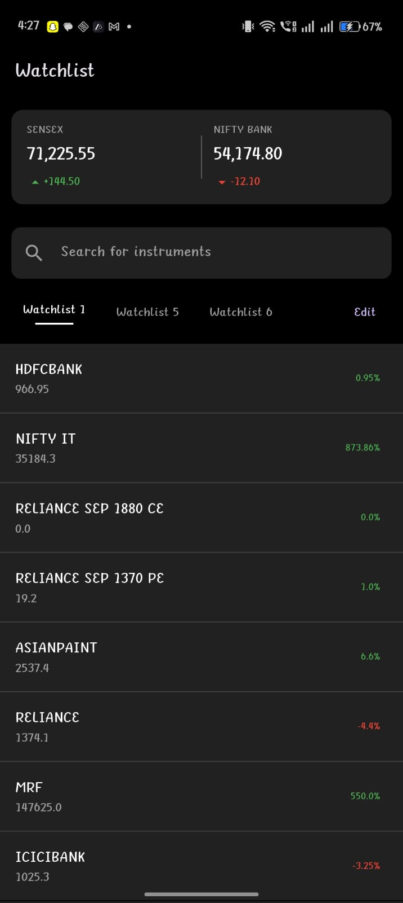
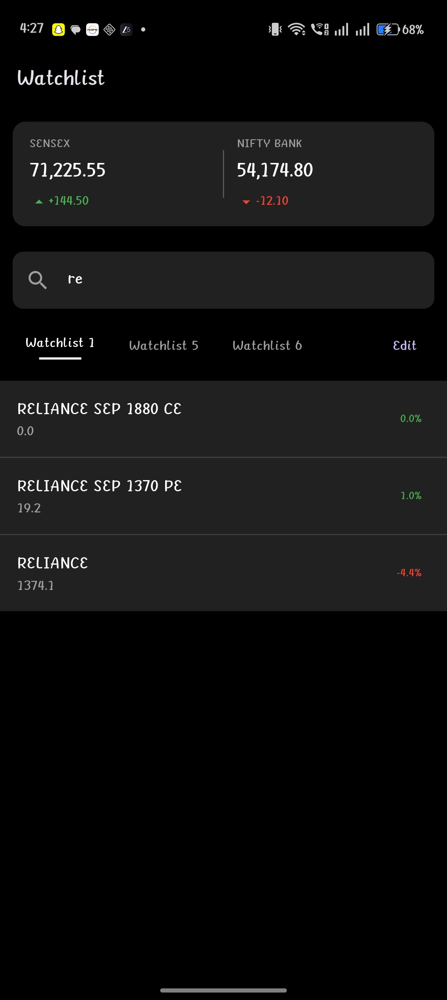
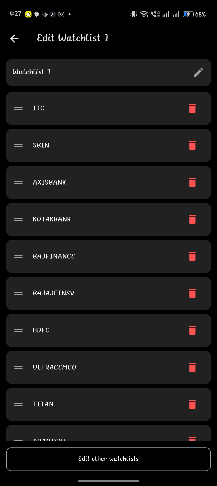
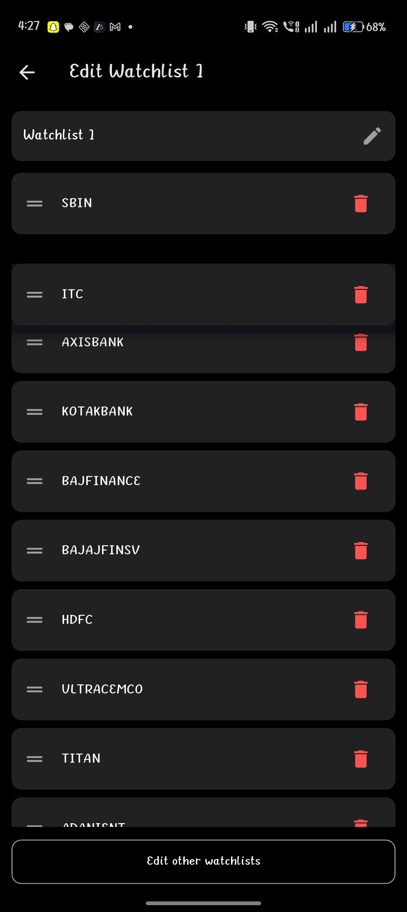

# 📈 Flutter Watchlist App (Assignment - 021 Trade)

## 🚀 Overview

This project is a **Flutter-based Watchlist Application** built as part of the assignment for the **Flutter Developer role at 021 Trade**.

The application simulates a **real-world trading watchlist**, allowing users to:

* View multiple stock watchlists
* Search instruments
* Reorder stocks using drag & drop
* Delete stocks from watchlist
* Experience a UI similar to modern trading apps

---

## 🎯 Features

### 📊 Market Overview

* Displays **SENSEX** and **NIFTY BANK**
* Shows price and change indicators (green/red)

### 🔍 Search Functionality

* Real-time filtering of stocks
* Case-insensitive search

### 📑 Multiple Watchlists

* Supports multiple watchlists (Watchlist 1, 5, 6)
* Dynamic switching using BLoC

### 🔄 Reorder Stocks

* Drag & drop functionality using `ReorderableListView`
* Managed via BLoC state

### 🗑️ Delete Stocks

* Remove stocks from watchlist
* Updates UI instantly

### 🎨 UI/UX

* Dark theme inspired by trading apps
* Smooth spacing and layout
* Responsive design
* Clean typography

---

## 🧠 Architecture

This project follows **BLoC (Business Logic Component) Architecture**.

### Why BLoC?

* Separation of UI & Business Logic
* Scalable structure
* Better state management
* Testable code

### Structure

```
lib/
│
├── data/
│   ├── models/
│   └── repository/
│
├── presentation/
│   ├── bloc/
│   ├── screens/
│   └── widgets/
│
└── main.dart
```

---

## ⚙️ State Management

Handled using:

```
flutter_bloc
```

### Key Concepts Used:

* Events (Load, Search, Reorder, Delete)
* States (Watchlist data, selected tab, search query)
* BlocBuilder for UI updates

---

## 📱 Screens

### 🏠 Watchlist Screen

* Market header
* Search bar
* Tabs
* Stock list

### ✏️ Edit Watchlist Screen

* Drag to reorder
* Delete stocks
* Watchlist management

---

## 📸 Screenshots

### 🏠 Watchlist Screen

<p align="center">
  
  
</p>

### ✏️ Edit Watchlist Screen

<p align="center">
  
  
</p>


---

## 📦 APK Download

👉 The release APK is included in this repository:

```
app-release.apk
```

You can install it directly on your Android device.

---

## 🛠️ How to Run Project

```bash
git clone <your-repo-link>
cd project
flutter pub get
flutter run
```

---

## 🏗️ Build APK

```bash
flutter build apk --release
```

---

## 🔮 Future Improvements

* Live stock price updates (API integration)
* Animations for price changes
* Persistent storage (Hive/SQLite)
* Swipe gestures
* Portfolio tracking

---

## 👨‍💻 Author

**Harikrishna Pathem**

---

## 📩 Submission

Submitted as part of Flutter Developer assignment for **021 Trade**.

---
